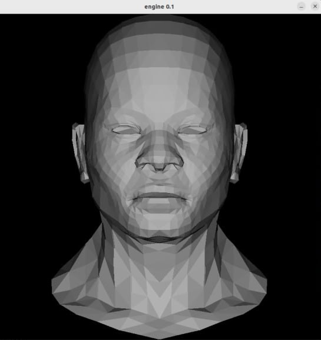

# 3d_engine_on_c

Простой 3d рендер на C++ с нуля like OpenGL для работы с графикой

- [Установка](#установка)
- [Использование](#использование)
- [Результат](#результат)
- [Лицензия](#лицензия)

## Установка

1. Клонируйте репозиторий:
      ```bash
      git clone https://github.com/coucco/3d_engine_on_c.git
      ```
2. Если git не установлен, терминал предложит его установить,
   установив git повторите команду.

## Использование

1. Перейдите в папку с репозиторием:
      ```bash
      cd 3d_engine_on_c
      ```
2. Соберите проект одним из способов:

    1. Ручками в терминале:
        1.  ```bash
            g++ -o main -O3 src/bin/main.cpp `sdl2-config --cflags --libs`
            ```
        2.  Если g++ не установлен, терминал предложит его установить,
            установив g++ повторите команду.

    2. С помощью CMake:
        1. Создайте директорию для сборки build и перейдите в нее:
            ```bash
            mkdir build
            ```
            ```bash
            cd build
            ```
        2. Соберите проект с помощью CMake:
            ```bash
            cmake ..
            ```
            ```bash
            make
            ```
            Если CMake не установлен, терминал предложит его установить,
            установив CMake повторите 2 последние команды из папки build.
    
3. Запустите собранный бинарный файл:
    ```bash
    ./main
    ```

## Результат

Результатом является получение отрисованной модельки в созданном окне:



## Планы на будущее

В планах добавить сглаживание и наложить на модель текстуры, а также написать движение камеры,
добавить тени и шейдеры, провести рефакторинг кода, введя красивый класс матриц и модели

## Лицензия

Этот проект распространяется под лицензией MIT. Подробности смотрите в файле LICENSE.