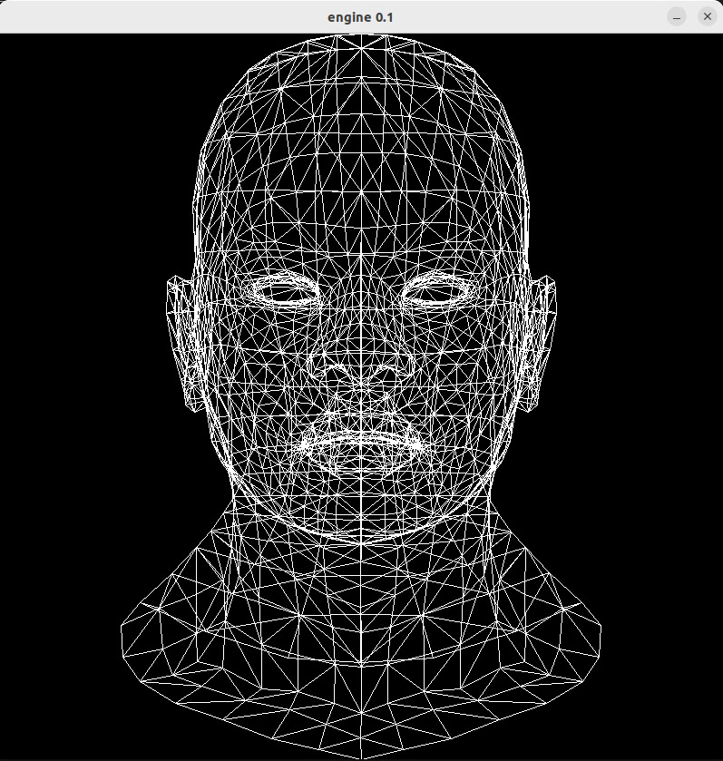
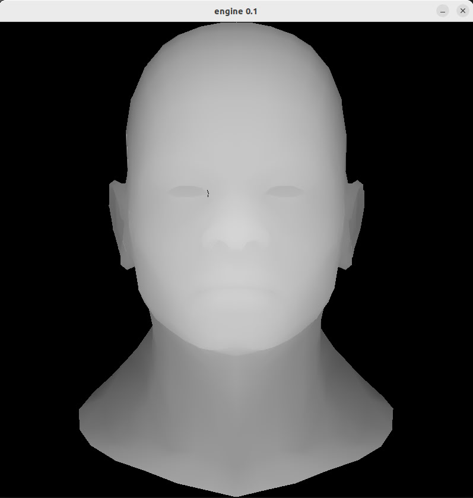
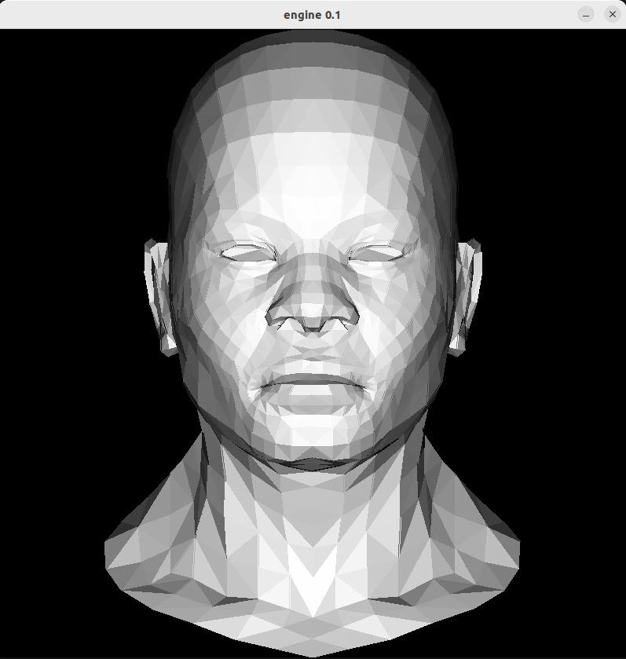
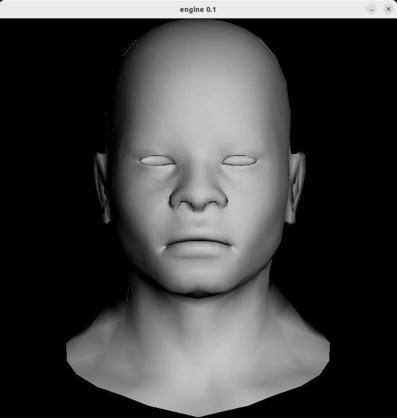

# 3d_engine_on_c

Простой 3d рендер на C++ с нуля like OpenGL для работы с графикой

- [Сборка](#сборка)
- [Использование](#использование)
- [Лицензия](#лицензия)

## Сборка

1. Клонируйте репозиторий:
      ```bash
      $ git clone https://github.com/coucco/3d_engine_on_c
      ```
     Если git не установлен, терминал предложит его установить,
     установив git повторите команду.

     Если репозиторий ранее был уже клонирован перейдите в папку с репозиторием
      ```bash
      $ cd 3d_engine_on_c
      ```
     И запульте изменения
      ```bash
      $ git pull
      ```

2. Перейдите в папку с репозиторием:
      ```bash
      $ cd 3d_engine_on_c
      ```
3. Соберите проект с помощью CMake:
    1. Создайте директорию для сборки build и перейдите в нее:
        ```bash
        $ mkdir build
        ```
        ```bash
        $ cd build
        ```
    2. Соберите проект с помощью CMake:
        ```bash
        $ cmake ..
        ```
        ```bash
        $ make
        ```
        Если CMake не установлен, терминал предложит его установить,
        установив CMake повторите 2 последние команды из папки build.

## Использование

1. Запустите собранный бинарный файл с нужными флагами:
    ```bash
    $ ./main provolka
    ```
    

    ```bash
    $ ./main zbuffer_check
    ```
    

    ```bash
    $ ./main polygon
    ```
    

    ```bash
    $ ./main polygon_smooth
    ```
    

## Планы на будущее

В планах наложить на модель текстуры, а также написать движение камеры,
добавить тени и шейдеры, провести рефакторинг кода, введя красивый класс матриц

## Лицензия

Этот проект распространяется под лицензией MIT. Подробности смотрите в файле LICENSE.